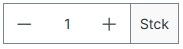
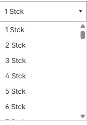
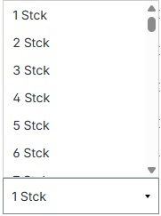

# DropdownSelector Plugin

A Shopware 6 plugin that replaces the standard quantity selector with a dropdown selector in the storefront's buy widget.

## Features

- Replaces the default quantity input with a dropdown selector in the product buy widget
- Seamlessly integrates with the Shopware 6 storefront
- Smart positioning for optimal display on all screen sizes

## Functionality Overview

The DropdownSelector plugin transforms your Shopware 6 product pages by replacing the standard quantity input with an intelligent dropdown selector. Here's a detailed look at how it works:

### Plugin Administration


*View plugin status through the Shopware administration panel.*

### Default Product Page


*The standard Shopware product page layout with the default quantity selector before activating the DropdownSelector plugin. This serves as a baseline for comparison.*

### Dropdown Functionality


*Once activated, the new dropdown selector replaces the default quantity input and expands downward by default, providing a clean and intuitive interface for quantity selection.*

### Smart Positioning


*The plugin features intelligent boundary detection - when there's insufficient space below, it automatically expands upward to ensure all options remain visible on screen.*

## Requirements

- Shopware 6.4.0 or higher
- PHP 7.4 or higher

## Installation

### Via Composer (recommended)

1. Change to your Shopware installation directory
```bash
cd /path/to/shopware
```

2. Install the plugin via Composer
```bash
composer require vendor/dropdownselector
```

3. Install and activate the plugin
```bash
bin/console plugin:install DropdownSelector
bin/console plugin:activate DropdownSelector
```

4. Clear the cache
```bash
bin/console cache:clear
```

### Manual Installation

1. Download the latest release
2. Extract the archive to your Shopware installation directory:
   ```powershell
   %SHOPWARE_ROOT%/custom/plugins/DropdownSelector
   ```
   Make sure the folder structure is exactly as shown above.

3. Execute the following commands in your Shopware root directory:   ```powershell
   php bin/console cache:clear
   php bin/console plugin:refresh
   php bin/console plugin:install DropdownSelector
   ```

4. Optional: If the plugin is not automatically activated after installation, either:
   - Run `php bin/console plugin:activate DropdownSelector` in the terminal
   - Or activate it through the Shopware Admin Panel

5. Verify installation in the Shopware Admin Panel:
   - Go to Settings > System > Plugins
   - Find "DropdownSelector" in the plugin list
   - The plugin should be listed as "Installed" and "Active"

## Activation

1. Go to Settings > System > Plugins
2. Find "DropdownSelector" in the plugin list
3. Ensure the plugin is activated

## Contributing

Contributions are welcome! Please feel free to submit a Pull Request.

## License

This project is licensed under the MIT License - see the [LICENSE](LICENSE) file for details.

## Support

For questions and support, please contact 3close Agency UG (haftungsbeschränkt) at:
[https://www.3close.de/answers/contact/](https://www.3close.de/answers/contact/)

You can also open an issue on GitHub for technical inquiries.

## Development

This plugin was developed with the assistance of Microsoft Copilot, leveraging AI technology to ensure high-quality code standards and best practices.
